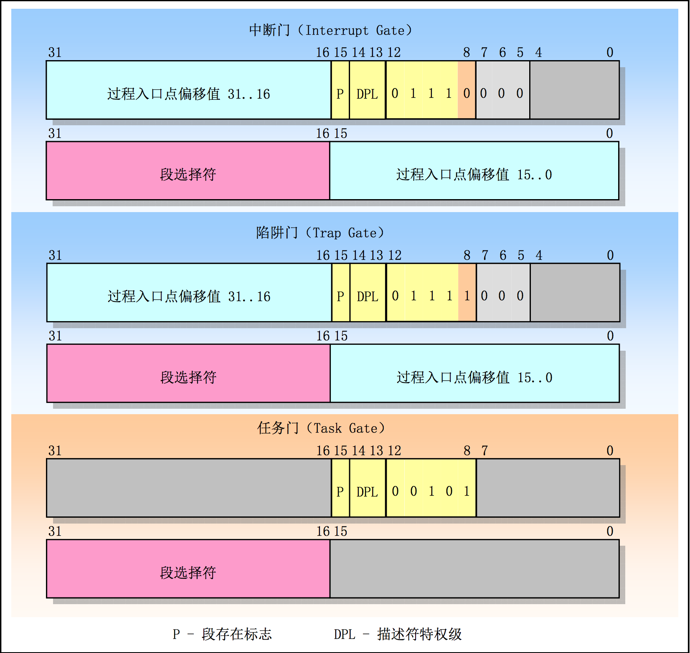

#IA32 data structure
---
##system registers:
 * EFLAGS (`reg`):

 * mmregs (`sreg`):

 * cregs (`creg`):

 * system instructions:
	 * instructions to manipulate system registers.

##memory management:
 * address transformation:

 * selector:

	 * RPL (Requested Privilege Level)
	 * TI (Table Index)
 * descriptor:
	 * segment descriptor:

	 * call gate descriptor:

	 * (interrupt, trap, task) gate descriptor:

	 * tss descriptor:

 * page_item:
