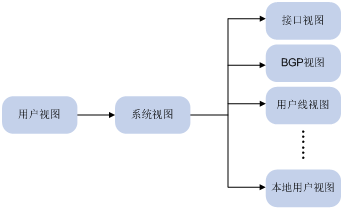
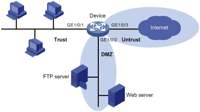

##firewall:
 * type: [H3C SecPath F1020](http://www.h3c.com.cn/Service/Document_Center/IP_Security/FW_VPN/F1020/)
 * guidance: 
	 * [manual](http://www.h3c.com.cn/Service/Document_Center/IP_Security/AQWG/H3C_SecPath_M9000/Configure/Operation_Manual/H3C_CG(V7)(R9115_ESS8206_ESS9204)-5W103/01/)
	 * views:  
	
	
	 * interfaces:
		 * 1/0/1 ~ 1/0/15:
			 * media type: twisted pair
		 * 1/0/16 ~ 1/0/23:
			 * media type: optical fiber

	 * security-zone:  
	
	
			