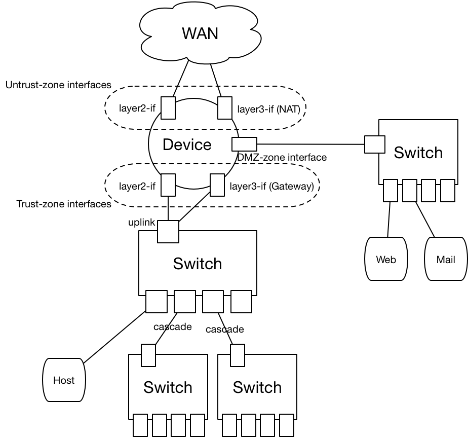

##References:
 * type: [H3C SecPath F1020](http://www.h3c.com.cn/Service/Document_Center/IP_Security/FW_VPN/F1020/)
 * guidance: 
	 * [manual](http://www.h3c.com.cn/Service/Document_Center/IP_Security/AQWG/H3C_SecPath_M9000/Configure/Operation_Manual/H3C_CG(V7)(R9115_ESS8206_ESS9204)-5W103/01/)
	 * views:  
	
	
	 * interfaces:
		 * 1/0/1 ~ 1/0/15:
			 * media type: twisted pair
		 * 1/0/16 ~ 1/0/23:
			 * media type: optical fiber

	 * security-zone:  
	

##防火墙配置：
 * 第一次连接：
	 * 连接防火墙的console口：
		 * 使用以太网口转串口转接线，连接PC，
		 * 或者采用菊花链用以太网口转串口-->串口转USB口，两条转接线，连接Laptop
	 * 使用win putty：略
	 * 使用linux screen：

				root# screen /dev/tty.usb-serial 9600

 * 配置http service和ssh service：
	 * 进入串口控制台后，

				[H3C] system-view #enter system view
				<H3C> service http enable #enable services
				<H3C> service ssh enable
				<H3C> interface GigabyteEthernet 1/0/1 \
				#enter interface view
				<H3C-GigabyteEthernet-1/0/1> ip address *.*.*.* \ 
				netmask *.*.*.* #setup ip for interface.
				<H3C-GigabyteEthernet-1/0/1> quit
				<H3C>
 * 使用web界面配置：
	 * 资源：
		 * ACL：
		 * 地址组：
	 * 防火墙：
		 * 安全域：
		 * 规则：
	 * 三层路由模式：
		 * 接口：
		 * 路由：
		 * NAT：

##组网实例
 * 二层+NAT
 