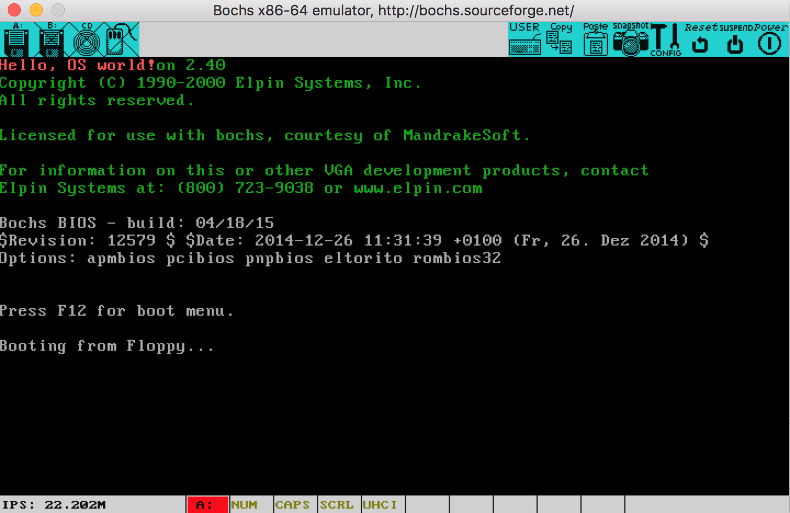
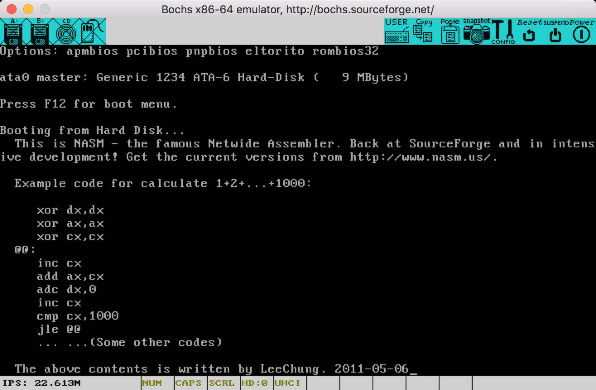

#bochs setup:
---
##compile bochs on MacOS Sierra:
 * complication:
	 * bochs on macos platform has bugs with x11, homebrew formula for bochs uses x11, so `brew install bochs` emits error.
	 * apple redirects gcc to clang, clang does not support some of the gcc's flags, so using `sh .conf.macosx` gives error saying gcc cannot generate executable files.

 * solution:
		
		#export CLICOLOR=1 to enable terminal color.
		john$ gunzip -c bochs-2.6.8.tar.gz | tar xvf -
		john$ cd bochs-2.6.8/
		john$ brew install sdl
		john$ ./configure --enable-ne2000 \
            --enable-all-optimizations \
            --enable-cpu-level=6 \
            --enable-x86-64 \
            --enable-vmx=2 \
            --enable-pci \
            --enable-usb \
            --enable-usb-ohci \
            --enable-e1000 \
            --enable-debugger \
            --enable-disasm \
            --disable-debugger-gui \
            --with-sdl \
            --prefix=$HOME/opt/bochs
		#export BXSHARE="$HOME/opt/bochs/share/bochs"
		#export PATH="$PATH:$HOME/opt/bochs/bin"

##hello, os (MBR)
  * 'Orange's os book' -- [(code)](../codes/osfromscratch) [(book)](books/orangesosbook.pdf)
  * asm code:
			
		;boot.asm
			org     07c00h
			mov     ax, cs
			mov     ds, ax
			mov     es, ax
			call    DispStr
			jmp     $
		DispStr:
			mov     ax, BootMessage
			mov     bp, ax
			mov     cx, 16
			mov     ax, 01301h
			mov     bx, 000ch
			mov     dl, 0
			int     10h
			ret
		BootMessage:            db      "Hello, OS world!"
		times   510-($-$$)      db      0
		dw      0xaa55

  * asm: `john$ nasm -o boot.bin boot.asm`
  * bximage:

		john$ bximage
		#create an fd
		#name: boot.img
  * dd: `john$ dd if=boot.bin of=boot.img bs=512 count=1 conv=notrunc`
  * bochsrc.bxrc:

		# how much memory the emulated machine will have
		megs: 32
		
		# filename of ROM images
		romimage: file=$BXSHARE/BIOS-bochs-latest
		vgaromimage: file=$BXSHARE/VGABIOS-elpin-2.40
		# what disk images will be used
		floppya: 1_44=boot.img, status=inserted
		
		# choose the boot disk.
		boot: floppy
		
		# where do we send log messages?
		log: bochsout.txt
		
		# disable the mouse
		mouse: enabled=0
		
		# enable key mapping, using US layout as default.
		#keyboard: keymap=/usr/share/bochs/keymaps/x11-pc-us.map

  * bochs:
  john$ bochs -f bochsrc.bxrc
		
		#on debug console:

		========================================================================
		                       Bochs x86 Emulator 2.6.8
		                Built from SVN snapshot on May 3, 2015
		                  Compiled on Jan 20 2017 at 01:34:54
		========================================================================
		00000000000i[      ] BXSHARE is set to '/Users/john/opt/bochs/share/bochs'
		00000000000i[      ] reading configuration from bochsrc.bxrc
		------------------------------
		Bochs Configuration: Main Menu
		------------------------------
		
		This is the Bochs Configuration Interface, where you can describe the
		machine that you want to simulate.  Bochs has already searched for a
		configuration file (typically called bochsrc.txt) and loaded it if it
		could be found.  When you are satisfied with the configuration, go
		ahead and start the simulation.
		
		You can also start bochs with the -q option to skip these menus.
		
		1. Restore factory default configuration
		2. Read options from...
		3. Edit options
		4. Save options to...
		5. Restore the Bochs state from...
		6. Begin simulation
		7. Quit now
		
		Please choose one: [6] 6
		00000000000i[      ] installing sdl module as the Bochs GUI
		00000000000i[SDL   ] maximum host resolution: x=2560 y=1600
		
		00000000000i[      ] using log file bochsout.txt
		Next at t=0
		(0) [0x0000fffffff0] f000:fff0 (unk. ctxt): jmpf 0xf000:e05b          ; ea5be000f0
		<bochs:1>
		
		#press c to continue.
		
  
	meanwhile on the sdl window:
	
  * see the Red "Hello"? it works!

---
#hello, loader
 * x86 asm os book [(code)](../codes/booktools) [(book)](books/x86asmosbook.pdf)
 * asm code: 
	 * [(c08_mbr.asm)](../codes/booktools/c08/c08_mbr.asm)
	 * [(c08.asm)](../codes/booktools/c08/c08.asm)
 * asm:
 		
 		john$ nasm -o mbr.bin c08_mbr.asm 
 		john$ nasm -o user.bin c08.asm
 		
 * bximage:
		
		john$ bximage
		#create an hd
		#name: boot.img
		#CHS=20/16/63
 * dd:
 		
 		john$ dd if=mbr.bin of=boot.img bs=512 count=1 conv=notrunc
 		john$ dd if=user.bin of=boot.img seek=100 bs=512 conv=notrunc

 * bochsrc:

		# how much memory the emulated machine will have
		megs: 32
		
		# filename of ROM images
		romimage: file=$BXSHARE/BIOS-bochs-latest
		vgaromimage: file=$BXSHARE/VGABIOS-elpin-2.40
		# what disk images will be used
		#floppya: 1_44=boot.img, status=inserted
		ata0-master: type=disk, path="boot.img", cylinders=20, heads=16, spt=63
		
		# choose the boot disk.
		#boot: floppy
		boot: disk
		
		# where do we send log messages?
		log: bochsout.txt
		
		# disable the mouse
		mouse: enabled=0
		
		# enable key mapping, using US layout as default.
		#keyboard: keymap=/usr/share/bochs/keymaps/x11-pc-us.map

 * bochs:

		john$ bochs -f bochsrc.bxrc
		#press 6 to start emulation
		#press c to continue
		
	
	voila!