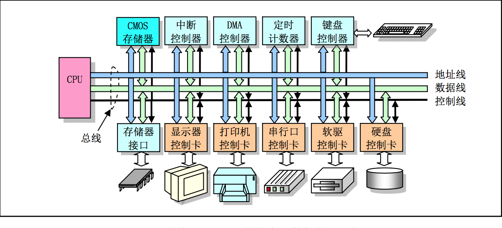
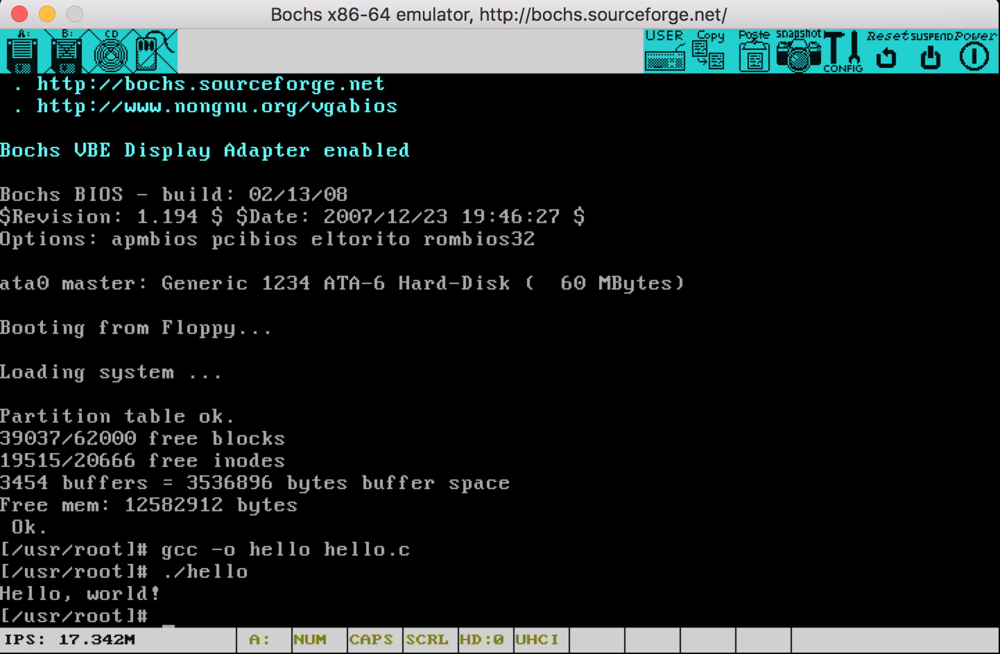
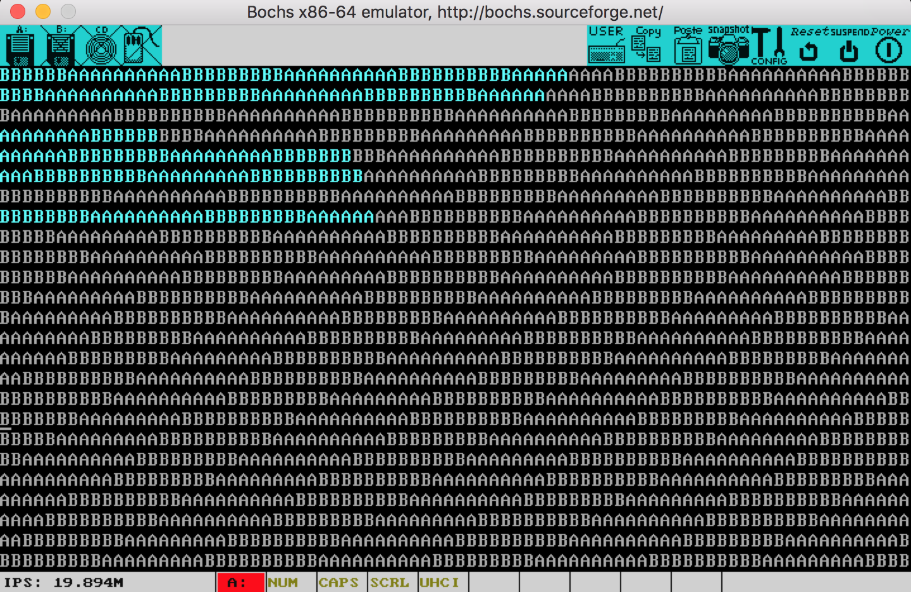

##history:
 * PC
	 * 1981 first IBM PC (IBM 5150):
		 * CPU intel 8088, 4.77MHz
		 * RAM 16KB
		 * OS PC-DOS 1.0 (early MS-DOS)
	 * 1982 IBM PC/XT (for enterprises),
	 * 1982 IBM OS/2
	 * 1984 IBM PC/AT:
		 * CPU intel 80286
		 * RAM 512KB
		 * HDD ISA 20MB (first time HDD joins standard configuration)
		 * OS MS-DOS 3.0
	
	 * IBM vs Apple:
		 * IBM uses open architecture.
		 * customizable
		 * helping MS, intel become monopoly.
	
	 * `PC/AT`
		 * generalized term, --
		 * refers to IBM PCs or compatible computers, --
		 * with CPU >= 80386
 * linux:
	 * 

##computer organization
 * diagram of **traditional** PCs: (modern PCs use chipset)  
	  
	* on-board:
		* BIOS-ROM
		* CMOS-RAM
		* controllers: interrupt, DMA, timer, keyboard
	* controller card:
		* (interfaces with bus using expansion slot.)
		* (expansion slots adopt bus interface standard: e.g. ISA, PCIE etc.)
		* e.g. MM, video card, ata, serial, etc.
* io:
	* addressing:
		* IBM PC uses **stand alone coding** to address io -- 
		* partially uses **unified coding** for video card.
		* addressing space
			* depends on type of bus interface
			* e.g. ISA 1K, PCI 64K
		* `ls /proc/ports/` to view io addressing space
	* access:
		* periodical query
		* interrupt
		* DMA

* others see [x86](x86.md)

##asm & c:
 * asm used by linux:
	 * as86 & ld86:
		 * intel grammar
		 * only used to asm mbr & loader in linux (have to because **gas does not support 16bits addressing**)
	 * gas ((gnu) as):
		 * at&t grammar
		 * for efficiency 10% percent of linux code are written in c.s (e.g. 32bits protected mode init etc.)
 * c language:
	 * gcc compiler:
		 * gnu gcc == C89+ (expanded C89 standard)
		 * 4 work stages:
			 * preprocess, compile, assembly, link
	 * make tool:
	 * inline assmebly:
		 * bit field in C: (don't get confused with `:` in `_asm`)

				#include <stdio.h>
				
				struct s{
				        int a:3;
				        int :0;
				        unsigned int b:3;
				        unsigned int :0;
				};
				//in context of a struct:
				//':' indicates number of bits a member occupies.
				//data type key word determines how a variable is interpreted.
				
				int main(){
				        struct s t;
				        t.a=7;
				        t.b=7;
				        printf("%d,%d\n",t.a,t.b);
				
				        return 0;
				}
				//output: "-1,7"
		 * example [strncmp](codes/oldlinux/examples/strncmp.c):

##bochs:
 * compile linux-0.11 on ubuntu:
	 * [source](codes/oslab)
	 * ported to [gcc-3.4](codes/gcc-3.4-ubuntu.tar.gz)
	 * docker:
		 
		 	john$ mkdir -p /home/oslab
		 	john$ cp codes/oslab /home/oslab & tar zxvf gcc-3.4-ubuntu.tar.gz /home/oslab/
		 	john$ cd /home/oslab/
		 	john$ vi Dockerfile
		 	
		 	#####################################
			FROM ubuntu:latest
			
			MAINTAINER johnsonyue version: 0.1
			
			ADD /home/oslab /home/oslab
			RUN sed -i 's/archive.ubuntu.com/mirrors.aliyun.com/g' /etc/apt/sources.list
			RUN apt-get update && apt-get install -y vim wget build-essential
			RUN /home/oslab/gcc-3.4/inst.sh
			
			CMD ["/bin/bash", "-D", "FOREGROUND"]
			
			:wq
			#####################################
			
			john$ docker build -t ubuntu-base .
			john$ docker run -ti ubuntu-base -v /home/oslab/:/home/oslab /bin/bash
				
	 * make:
			
			john$ export OSLAB_PATH="/home/oslab"
		 	john$ cd $OSLAB_PATH/linux-0.11/
		 	john$ make
		 	as kernel/chr_drv/keyboard.S keyboard.o
		 	ERROR: *some_function* already defined
		 	#Reason: somehow 'as' got executed before 'gcc keyboard.S ../../config.h'
		 	#To cope with, manually execute 'gcc keyboard.S ../../config.h'
		 	
		 	john$ cd $OSLAB_PATH/bochs
		 	john$ vi bochsrc.bxrc
		 	
		 	#comment unsupported settings.
		 	
		 	john$ bochs -f bochsrc.bxrc
		 	
	
	Boom!

* compile linux 0.00 on ubuntu (the one with AAAAABBBBAAAAA):
	* [source](codes/linux-0.00):
		* downloaded from [oldlinux](oldlinux.org)
		* modifications:
			* not compatible with newest gas,
			* use [gcc-3.4](codes/gcc-3.4-ubuntu.tar.gz) -c instead
	* docker:
		* same as [compile linux-0.11 on ubuntu]()
	* after make:

			john$ bochs -f bochsrc-0.00.bxrc
			
	
	Boom!