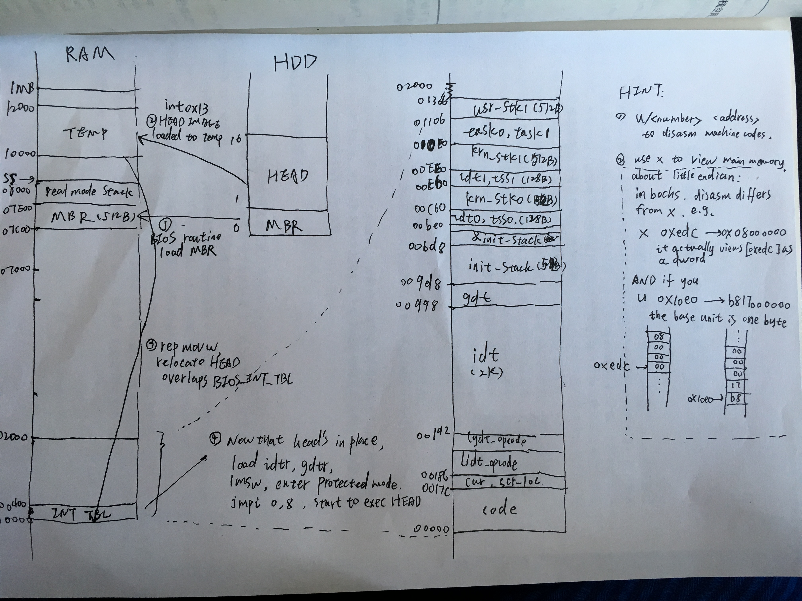

##boot.s & head.s (zhaojiong)
 * mm image:

 * [PIT chip](http://wiki.osdev.org/Programmable_Interval_Timer) (8253):
	 * The PIT chip uses the following I/O ports:

			I/O port     Usage
			0x40         Channel 0 data port (read/write)
			0x41         Channel 1 data port (read/write)
			0x42         Channel 2 data port (read/write)
			0x43         Mode/Command register (write only, a read is ignored)

	 * The Mode/Command register at I/O address 0x43 contains the following:

			Bits         Usage
			6 and 7      Select channel :
			             0 0 = Channel 0
			             0 1 = Channel 1
			             1 0 = Channel 2
			             1 1 = Read-back command (8254 only)
			4 and 5      Access mode :
			             0 0 = Latch count value command
			             0 1 = Access mode: lobyte only
			             1 0 = Access mode: hibyte only
			             1 1 = Access mode: lobyte/hibyte
			1 to 3       Operating mode :
			             0 0 0 = Mode 0 (interrupt on terminal count)
			             0 0 1 = Mode 1 (hardware re-triggerable one-shot)
			             0 1 0 = Mode 2 (rate generator)
			             0 1 1 = Mode 3 (square wave generator)
			             1 0 0 = Mode 4 (software triggered strobe)
			             1 0 1 = Mode 5 (hardware triggered strobe)
			             1 1 0 = Mode 2 (rate generator, same as 010b)
			             1 1 1 = Mode 3 (square wave generator, same as 011b)
			0            BCD/Binary mode: 0 = 16-bit binary, 1 = four-digit BCD

		 * For the "lobyte/hibyte" mode, 16 bits are always transferred as a pair, with the lowest 8 bits followed by the highest 8 bits (both 8 bit transfers are to the same IO port, sequentially -- a word transfer will not work).

 * code in head.s:
	 * TS (task switching) scenarios:
		 * call/jmp (tss descriptor)
		 * call/jmp (task gate)
		 * interrupt (task gate)
		 * iret NT
	 * constrol transfer in head.s:
		 1. kernel --> user task0 (task switching):

				NT <- $0
				TR <- $TSS0_SEL
				LDTR <- $LDT0_SEL
				push 0x17:$init_stack
				push 0x0f:$task0
				iret
			 * iret requires stack switching, hence push 0x17:$init_stack,
			 * init_stack serves as usr_stk0
		 2. user task0/1 --> timer_interrupt (interrupting):
			 * cpl=3 < dpl=0, requires stack switching
			 * swtiches to krn_stk0 provided by tss0.
			 
			 (**processor automatically**) pushes ss:esp, eflags, and cs:eip.
			 * because task switching in "1." is done by `iret`, **processor automatically** resets nt in eflags.
		 3. timer_interrupt --> user task1/0 (normal interrupt returning):
			 * for reasons described in "2.", nt=0,
			 * `iret` in timer_interrupt simply returns without switching task.

##kernel organization:
 * diagram:

 * system call & libs:
	 * lib function is a encapsulation of system calls, 
		 * implemented using macros, and inline asm.
	 * who wrote the libs:
		 * c is just a compiler.
		 * libs provides API (functions) for user programs,
		 * POSIX is a API standard for *nix systems. Standards make user programs portable.
		 * so the answer: libs should be written by OS developers?

##bootsect&setup&head (linux0.11)
 * bootsect.s:
	 * read_it pseudo:

			//pseudo code:
			static t_int16 SYSEND=SYSSEG+SYSSIZE; //0x9000
			static t_int16 SECTORS=***; //determined by hardware.
			extern void read_track(t_int16 ax, t_int16 track, t_int16 sread); //int 0x13; ah=2; read sectors on a track.
			void read_it() //read_it means to load system to 0x10000 ~ 0x90000.
			{
				t_int16 sread = 0; //number of sectors read on current track.
				t_int16 head = 0; //enum{0,1}
				t_int16 track = 0; //current track/cylinder.
				t_int16 ax; //number of sectors to be read.
				t_int16 es, bx; //segment base and offset.
				while(1){
					if (es>=SYSEND){break;} //end condition.
					ax = SECTORS - sread;
					if (ax*512+bx >= 65536){
						ax = 65536 - bx;
					} //to make sure 64KB boundries are not crossed.
					read_track(ax, track, sread); //sread+1 tells int0x13 which sector to start with.
					if (head == 1){
						track++; //if "side B" is read, cont to next track.
					}
					else{
						head = 1;
					} //two sides of each track.
					
					sread = sread + ax; 
					if (sread >= SECTORS){
						sread = 0;
					} //update sread.
					
					bx = bx + ax*512; //update segment offset.
					if (bx >= 65536){
						es += 0x1000;
						bx = 0;
					} //if finished reading one 64K segment, cont to next.
				}

	 * asm source of read_it looks something like this:

		  	read_it:
				mov ax,es
				test ax,#0x0fff
			die:	jne die			! es must be at 64kB boundary
				xor bx,bx		! bx is starting address within segment
			rp_read:
				mov ax,es
				cmp ax,#ENDSEG		! have we loaded all yet?
				jb ok1_read
				ret
			ok1_read:
				seg cs
				mov ax,sectors
				sub ax,sread
				mov cx,ax
				shl cx,#9
				add cx,bx
				jnc ok2_read
				je ok2_read
				xor ax,ax
				sub ax,bx
				shr ax,#9
			ok2_read:
				call read_track
				mov cx,ax
				add ax,sread
				seg cs
				cmp ax,sectors
				jne ok3_read
				mov ax,#1
				sub ax,head
				jne ok4_read
				inc track
			ok4_read:
				mov head,ax
				xor ax,ax
			ok3_read:
				mov sread,ax
				shl cx,#9
				add bx,cx
				jnc rp_read
				mov ax,es
				add ax,#0x1000
				mov es,ax
				xor bx,bx
				jmp rp_read
			
			read_track:
				push ax
				push bx
				push cx
				push dx
				mov dx,track
				mov cx,sread
				inc cx
				mov ch,dl
				mov dx,head
				mov dh,dl
				mov dl,#0
				and dx,#0x0100
				mov ah,#2
				int 0x13
				jc bad_rt
				pop dx
				pop cx
				pop bx
				pop ax
				ret
			bad_rt:	mov ax,#0
				mov dx,#0
				int 0x13
				pop dx
				pop cx
				pop bx
				pop ax
				jmp read_track

 * setup.s:
	 * 
