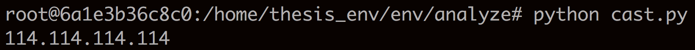

#研究思路：
 * 弄清楚得到ITDK的命令是什么
 * 把ITDK的监测点，测量时间，测量目标，其他细节弄清楚，
 * 把数据格式弄清楚，改进之前的scanner，实现最终模拟caida的程序
 * 待解答问题 与解答：  
看CAIDA 怎么用scamper (UDP? -- paris_udp by default  
3 packets per hop?) -- 2 probes by default  
再把CAIDA数据看一遍，ITDK包不包含终端? -- 别名解析时不包含终端，输出的路由器结果中包含终端和源点

------
##UDP or ICMP?
 * ctags how-to:
	 * ubuntu ships with the exuberant ctags,
	 * to generate ctags for cwd, run `ctags -R .`
	 * while browsing with vim, 

<table border="1" class="docutils">
<colgroup>
<col width="31%">
<col width="69%">
</colgroup>
<thead valign="bottom">
<tr><th class="head">
Keyboard command

</th>
<th class="head">
Action

</th>
</tr>
</thead>
<tbody valign="top">
<tr><td>
<tt class="docutils literal">Ctrl-]</tt>

</td>
<td>
Jump to the tag underneath the cursor

</td>
</tr>
<tr><td>
<tt class="docutils literal">:ts &lt;tag&gt; &lt;RET&gt;</tt>

</td>
<td>
Search for a particular tag

</td>
</tr>
<tr><td>
<tt class="docutils literal">:tn</tt>

</td>
<td>
Go to the next definition for the last tag

</td>
</tr>
<tr><td>
<tt class="docutils literal">:tp</tt>

</td>
<td>
Go to the previous definition for the last tag

</td>
</tr>
<tr><td>
<tt class="docutils literal">:ts</tt>

</td>
<td>
List all of the definitions of the last tag

</td>
</tr>
<tr><td>
<tt class="docutils literal">Ctrl-t</tt>

</td>
<td>
Jump back up in the tag stack

</td>
</tr>
</tbody>
</table>

 * navigate using `ctags`, debug with `gdb`:  
found the TYPE macro
 
 defintion of the macro (in scamper_trace.h):
 
 (from the definition of the macro, the type is actually in the trace->type field)  
//////////////////////////////////////////////////
 
 (From further digging, we learn that trace is actually produced by `scamper_task_getdata` which takes a `scamper_task_t` pointer as argument)  
 (that is, task->data determines the trace type!)
 
 //////////////////////////////////////////////////

 (And "where is the task?" you may ask, just need to find where the `do_trace_probe` is actually called)  
 
 (the task->funcs->probe actually points to `do_trace_probe`: scamper_task.c 679)
 
  //////////////////////////////////////////////////

 (task initialized here: scamper.c 1348)
 
 //////////////////////////////////////////////////
 
 (anyway found dat madafaka: trace/scamper_trace.h 60)
 
 
 it's actually using Paris traceroute by defaut,
 (which makes perfect sense).
 //////////////////////////////////////////////////
 
 * A few gdb how-to s:
	 * To enter the execution flow:  
	 `(gdb) break scamper_task_probe`  
	 `(gdb) run`
	 * [The gdb cheatsheet](books/gdbcheatsheet.pdf):
		 * use `print` to inspect variables
		 * use `x/nfu` to inspect memory.
			 * n stands for number,
			 * f, format (x(hex), d(decimal), c(character))
			 * u, unit (w(double word), h(half word)), omit u when f is 'c')
			 * e.g. : `x/32c string`,`x/32xw hexvar`

 * The dst address:
 
 `int 1920103026` is actually the ip `114.114.114.114`.
   
 
 pwn!
 
##man scamper:
 * tracelb (load balancing)
 * trace -f 2 (set first hop TTL to 2)
 * trace -P UDP-paris (probing method used)

			-P method
			specifies the traceroute method to use.
			scamper currently supports five different probe methods:
			UDP, ICMP, UDP-paris, ICMP-paris, TCP, and TCP-ACK.  
			By default, UDP-paris is used.
			
			-q attempts
			specifies the maximum number of attempts \ 
			to obtain a response per hop.
			By default, a value of two is used.

##`-I` command:
 * it uses polymorphism!

 * juicy implementation:

see the default value of type is actually `UDP_PARIS`
 * double tree:

 * code with annotation:
 		
 		root# scamper -I 'trace -P paris_udp 202.118.224.100'
 		
		//scamper.c
		int main(){
			...
			i = scamper(argv, argc);
			...	
		}
		
		static int scamper(int argc, char *argv[]){
			...
			if(options & (OPT_IP|OPT_CMDLIST)){
				if((source = scamper_source_cmdline_alloc( \
				&ssp, command,arglist, arglist_len)) \ 
				== NULL){
					return -1;
				}
			}
			...
		}

		//scamper_source_cmdline.c
		scamper_source_t *scamper_source_cmdline_alloc( \
		scamper_source_params_t *ssp, \ 
		const char *cmd, \
		char **arg, \
		int arg_cnt){
			...
			/*
			 * the part that concerns the -I option
			 *
			 */
			if(cmd != NULL){
			cmd_len = strlen(cmd);
			for(i=0; i<arg_cnt; i++){
				if( \
				command_assemble(&buf, &len, cmd, cmd_len, arg[i]) != 0 \ 
				|| scamper_source_command(source, buf) != 0){
					goto err;
				}
			}
			}
			...
		}
		
		//scamper_sources.c
		int scamper_source_command(scamper_source_t *source, const char *command)
		{
		  const command_func_t *func = NULL;
		  command_t *cmd = NULL;
		  char *opts = NULL;
		  void *data = NULL;
		
		  sources_assert();
		
		  if((func = command_func_get(command)) == NULL)
		    goto err;
		  if((data = command_func_allocdata(func, command)) == NULL)
		    goto err;
		
		  if((cmd = command_alloc(COMMAND_PROBE)) == NULL)
		    goto err;
		  cmd->un.pr.funcs    = func;
		  cmd->un.pr.data     = data;
		  cmd->un.pr.cyclemon = scamper_cyclemon_use(source->cyclemon);
			/*
			 *dlist is a implementation of link.
			 *arg#1: source->commands is the list.
			 *arg#2: cmd is the node to be inserted.
			 */
		  if(dlist_tail_push(source->commands, cmd) == NULL)
		    goto err;
		
		  source_active_attach(source);
		  sources_assert();
		  return 0;
		
		 err:
		  if(opts != NULL) free(opts);
		  if(data != NULL) func->freedata(data);
		  if(cmd != NULL) free(cmd);
		  sources_assert();
		  return -1;
		}
		
##patrcia:
 * found patricia:

##ITDK readme:
 * [ITDK](http://www.caida.org/data/internet-topology-data-kit/)
 * 每一份，由三个月的traceroute测量原始数据得到：
 * 数据内容：
	 * kapar和非kapar路由器拓扑，（kapar有false positive，increases converage，inflates router size，decrease router count）
	 * 路由器到ASN映射
	 * 路由器地理位置
	 * 发现IP地址的反向域名
 * 原始数据：
	 * [The IPv4 Routed /24 Topology Dataset](http://www.caida.org/data/active/ipv4_routed_24_topology_dataset.xml)
 * 接口合并主动测量：
	 * 2017-02-07 to 2017-02-13 on 41 monitors (in 24 countries)
	 * MIDAR target IP:
		 * 2.8 million IP, extracted from IPV4/24 result.  
		   (2017-01-22 to 2017-02-07)  
		   (35 cycles of traces [12 from
	  team 1, 13 from team 2, 10 from team 3)  
	      (cycles 5397 to 5431 from 121 monitors in 42 countries -- all active Ark monitors instead of the subset used for MIDAR)
	      (提取的时候，不包含终端节点)
	      (输出结果的时候，又加入终端节点和监测点)
	      (输出结果的时候，给IP标注上是终端D(Destination)还是路由器T(Transit))
	      (此外标注上IP关联的路由器ID和链接ID)
	      (T和D不互斥)
	      (一般说标注为T的IP必然有链接ID，然而源IP和Traceroute的第一条IP没有)
	      

		 * groud truth IP:
			 * 154 addresses in ground truth from an R&E network (GEANT)
	 * iffinder target IP:
		 * 同MIDAR  
			 (2017-02-09)  
			 (61 monitors)  
			 (each independently probe 2.8 million IP, random order)

 * ASN:
	 * RIPE, Routeviews, 201702
	 * Node to ASN: 简单启发法:
		 * 选接口中频率显著高的AS
		 * 不显著选度最低的AS，（因为最有可能是客户，而客户路由器接口通常用提供商的地址空间IP）
 * Geo:
	 * 3 sources:
		 * public IXP info,
			 * wiki ixp list, 
			 * Looking Glass database
			 * PeeringDB
			 * PCH IX
			 * City name: Geoname 
		 * CAIDA 的DDec工具(DNS Decode), 
		 * GeoLite

		 * 先用IX定，IX定位不到DDec定，DDec定位不到mmdb定，mmdb有歧义丢弃该路由器。
	 * validation:
		 * find infered routers which colocate with monitors.
		 * assume city radius is 10km, routers with less than 3ms delay must colocates with the monitor.
		 * 

 * Data Format:
	 * 224.0.0.0/3 (IANA 保留多播地址)，用来标识匿名路由器。
	 * 节点和边分开：
		 * 一行一个节点：路由器ID+路由器上的接口
		 * 一行一个链接，其含义是IP级别的链接，可以有多个路由器连接。（相当于交换机）（a construct that represents either a point-to-point link, or LAN or cloud with multiple attached IP addresses）
		 * 两个文件结合，可以区分出两类接口，一种是已知接口，即在traceroute中出现的IP，另一种是推断接口，通过两个路由器的链接关系，若已知一个接口的IP，另一个接口未知，则可以推断另一个接口是已知IP网段内的一个IP。
 * DNS:
	 * 用CAIDA的dolphin工具，为了避免冗余dolphin7天内不重测，ITDK中的DNS是2017-02-07 to 2017-02-13 7天的dolphin结果
	 * 还要多下载前后几天的，为了防止dolphin未查询出结果的情况。
 * BGP:
	 * IP到ASN的转换，先匹配最长前缀，再匹配该前缀的起源AS